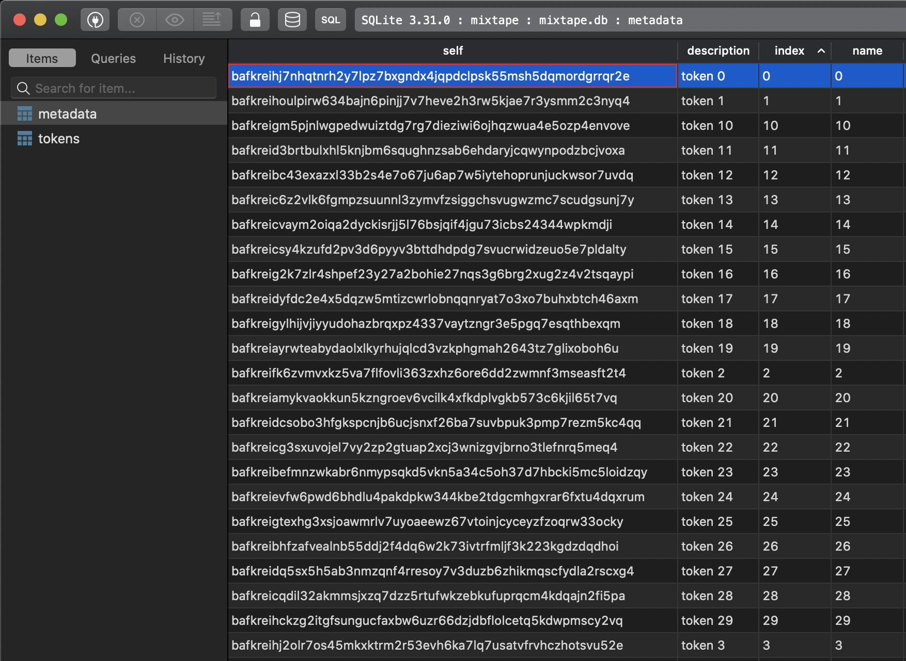

# Mixtape

> Ultra-portable NFT database in a single SQLite3 file

Mixtape is a portable database designed to store, manage, and share:

1. **NFT Metadata:** Store and index all the NFT metadata attributes.
2. **Offchain NFTs:** Store and query offchain NFTs, which can be converted to onchain NFTs by writing to the blockchain.

---

# Quickstart

Create a new project folder, initialize the project:

```
mkdir newproject && cd newproject && npm init
```

Install with NPM:

```
npm install mixtapejs
```

Write some code to write to mixtape. For simplicity, we will use an auto-migrating configuration for this example:

```javascript
const Mixtape = require('mixtapejs')
const mixtape = new Mixtape();
(async () => {
  // initialize
  await mixtape.init({
    config: {
      metadata: { schema: "migrate" }
    }
  })
  // loop through 100 items and insert to the "metadata" table
  for(let i=0; i<100; i++) {
    await mixtape.write("metadata", {
      name: i,
      description: "token " + i,
      attributes: [{
        trait_type: "index",
        value: i
      }]
    })
  }
})();
```

When you run the code above, you'll see that it has created a new file named `mixtape.db`. You can open this in your favorite SQLite client. Here's what it will look like:



If you don't have an SQLite client, you can find one here: https://medevel.com/13-sqlite-database-clients-managers/


---

# Writing

There are 3 ways Mixtape handles writes (insertion) of new objects into the database.

1. Fixed Schema with auto migration: `{ schema: "reject" }`
2. Fixed Schema with auto filter: `{ schema: "fiter" }`
3. Dynamic schema: `{ schema: "migrate" }`

## 1. Reject mode

When the Mixtape DB is initialized with a **reject mode**, any item that doesn't fit into the predefined schema will **fail to insert and throw an error**.

Can be initialized with `{ schema: "reject" }`. 

**This is the default mode.**

## 2. Filter mode

When the Mixtape DB is initialized with a **filter mode**, whenever you try to insert an item that doesn't fit into the predefined schema, Mixtape will automatically filter only the attributes that fit into the existing schema and try its best to insert them to the table.

Can be initialized with `{ schema: "filter" }`

## 3. Migrate mode

When the Mixtape DB is initialized with a **migrate mode**, whenever you try to insert an item with new columns that don't fit into the existing schema, Mixtape will automatically migrate the table to add those columns and insert them.

Caveat: Columns can only be added, not removed.

Can be initialized with `{ schema: "migrate" }`


---

# Reading

## SQL (all platforms)

At the end of the day, Mixtape is just an SQLite database named `mixtape.db`.

This means you can share the entire DB over email attachments, make them publicly downloadable as a single file, and so forth.

And anyone can take the file and open it with [a variety of SQLite clients](https://medevel.com/13-sqlite-database-clients-managers/) on [all kinds of platforms](https://www.sqlite.org/mostdeployed.html), as well as query and manipulate the DB programmatically using various SQLite libraries.

## sql.js (browser)

The great thing about SQLite is that [it's supported almost everywhere](https://www.sqlite.org/mostdeployed.html), including the browser.

You can use the [SQL.JS](https://sql.js.org/documentation/) library to load the `mixtape.db` file inside a browser and query the DB from the browser WITH no server hosting needed.


## Mixtape (Built-in Query Language)

While you can use regular SQL to interact with Mixtape, Mixtape has implemented a simple Query language that gives an easy abstraction on top of SQL.

> This is especially useful when you are already using the `mixtapejs` package in your app. Instead of having to use another SQLite library you can just use the built-in read methods.

This query language is JSON based, which means it can be directly fed into a local program as well as sent over the network to interact with a remote Mixtape database.

You can use these with the following built-in node.js methods:

- [read()](#read)
- [readOne()](#readOne)


### top level keywords

The query language is simply a JSON representation of an SQL query. Here are all the attributes allowed in the query language:

```
{
  select: [<col>, <col>, .. ],
  from: tokens|trades,
  join: [args],
  where: [args],
  order: <orderBy>,
  limit: <limit>,
  offset: <offset>
}
```

The JSON gets translated into a [knex.js](https://knexjs.org/) query, which then gets translated to an SQL query statement. For example,

```json
{
  "select": ["tokenId"],
  "from": "tokens",
  "where": ["created_at", "<", 1629617382843],
  "limit": 10,
  "order": ["created_at", "desc"]
}
```

Translates to:

```
SELECT tokenId
FROM tokens
WHERE created_at < 1629617382843
LIMIT 10
ORDER BY created_at desc;
```

### "where" clause

The where can take two forms:

- **object:** Often you just want a simple "AND" operation for exact matches of multiple attributes. In this case you can use the object notation made up of `<key>:<value>` pairs where:
  - `<key>`: the column name
  - `<value>`: the corresponding value for the column
- **array:** For other queries where you want more flexibility, you can use the array notation, where each chunk of the query string is the array item.
  - Example: `{ where: ["created_at", "<", 1629617382843] }`

---

# Database Schema

There are currently 2 built-in tables with Mixtape:

1. `token`: The token table. used to store offchain NFTs
1. `metadata`: The metadata table. used to store NFT metadata


## 1. token table

The current version of the token table has a **fixed schema**. (Future versions may have different columns)

- **signed:** whether the stored token contains a signature or not
  - `type:` boolean
  - `index:` true
- **self:** the IPFS CID of the full token JSON itself.
  - `type`: string
  - `notNullable`: true
  - `primary`: true
  - `index`: true
- **id:** the tokenId of the NFT as defined by the metadata
  - `type`: string
  - `notNullable`: true
  - `index`: true
- **encoding:** whether the metadata CID encoding is `raw` or `dag-pb`. `0` if raw, `1` if dag-pb.
  - `type`: integer
  - `notNullable`: true
- **cid:** the IPFS CID of the metadata. the `id` and `raw` attributes can be derived from this attribute.
  - `type`: string
  - `notNullable`: true
- **sender:** the account allowed to mint this token. (set as a `0x0` address if anyone can mint)
  - `type`: string
  - `index`: true
- **receiver:** the account that will receive the token when minted (set as a `0x0` address if whoever mints the token will receive the token)
  - `type`: string
  - `index`: true
- **value:** the value at which this token can be minted to the blockchain
  - `type`: bigInteger
  - `index`: true
- **start:** the start time (unix timestamp in seconds) at which this token can be minted onto the blockchain. Set to 0 if immediately mintable.
  - `type`: integer
- **end:** the end time (unix timestamp in seconds) at which this token can NO LONGER be minted onto the blockchain (mint expiration time). Set to max integer if it never expires.
  - `type`: integer
- **royaltyReceiver:** the beneficiary of the NFT sales royalty when this token is minted and whenever a sale is made.
  - `type`: string
  - `index`: true
- **royaltyAmount:** the royalty amount out of 1,000,000 for each sale, which will be sent to the `royaltyReceiver` whenever a sale is made.
  - `type`: integer
- **sendersHash:** the merkle root of all the addresses allowed to mint
  - `type`: string
  - `index`: true
- **receiversHash:** the merkle root of all the addresses allowed to receive the NFT when minted
  - `type`: string
  - `index`: true
- **puzzleHash:** the sha3 hash preimage to which the minter needs to provide a solution in order to mint the token onto the blockchain.
  - `type`: string
  - `index`: true
- **created_at:** the timestamp at which the token was saved to this database
  - `type`: bigInteger
  - `index`: true

## 2. metadata table

### features

The metadata table is optimized for dealing with the [NFT Metadata Standard](https://docs.opensea.io/docs/metadata-standards#metadata-structure) natively.

More specificlaly,

1. The metadata table can insert all the top level attributes (such as "name", "description", "image", etc.) as the columns
2. The metadata table also extracts out all the attributes in the [attributes array](https://docs.opensea.io/docs/metadata-standards#attributes)  and populates each as a column
3. The metadata table also indexes them with an attribute named `self`, which is the IPFS CID of the metadata locally calculated from the contents (WIHTOUT publishing to the global IPFS network).

### schema

The metadata table does not have any predefined attributes.

This means you will need to make a decision when you initialize the database:

1. Will I want to automatically add new columns as new attributes are discovered? => **use migrate mode**
2. Will I want to fix a set of attributes in the schema
    - will I want to only filter the attributes specified in the schema and ignore other attributes? => **use filter mode**
    - will I want to ignore insertion altogether when trying to insert new attributes? => **use reject mode**

Once you have decided on this, you can initialize the Mixtape DB using whichever mode you want.


---

# Install

You can install with NPM:

```
npm install mixtapejs
```

Then you can require it in your app like this:

```javascript
const Mixtape = require('mixtapejs')
```

---

# API

## constructor

creates a Mixtape instance

### syntax

```javascript
const mixtape = new Mixtape()
```

#### parameters

- none

#### return value

- an instantiated `mixtape` object

## init()

initialize a mixtape instance

### syntax

```javascript
await mixtape.init(options)
```

#### parameters

- `options`: an initializer object made up of 3 attributes:
  - `path`: The folder path at which the `mixtape.db` file should be created
  - `schema`: The schema definition. It's an object made up of `<key>/<value>` pairs where:
    - `<key>`: The name of the column
    - `<value>`: an object that defines all the constraints for the `<key>` column. Can have the following attributes:
      - `primary`: is it a primary key?
      - `notNullable`: should a null value be allowed?
      - `defaultTo`: the default value
      - `maxLength`: max size of this column (in case it's a "string" type)
      - `index`: should this column be indexed?
  - `config`: configuration object
    - `schema`: specify the policy to enforce the schema. There can be 3 options for this attribute: **"reject"**, **"filter"**, **"migrate"**
      - **reject**: reject all attempts to insert items with any attribute that doesn't validate against the schema
      - **filter**: Filter out all the new attributes that don't fit into the existing schema, and allows the insertion of the filtered object.
      - **migrate**: whenever a new attribute is encoutered, automatically migrate the table to add those columns before writing.

#### return value

- none

### examples

#### automigrate new attributes

```javascript
const Mixtape = require('mixtapejs')
const mixtape = new Mixtape()
await mixtape.init({
  path: process.cwd(),
  config: {
    metadata: {
      schema: "migrate"
    }
  }
})

// The following 3 calls will automatically migrate the DB to add the columns "whatever", "whatever2", and "whatever3" before inserting the items.
await mixtape.write("metadata", {
  whatever: "hi"
})
await mixtape.write("metadata", {
  whatever2: "hi"
})
await mixtape.write("metadata", {
  whatever3: "hi"
})

//  After running the functions above, now the DB will look something like this:
//  
//  [
//    { whatever: "hi", whatever2: null, whatever3: null },
//    { whatever: null, whatever2: "hi", whatever3: null },
//    { whatever: null, whatever2: null, whatever3: "hi" }
//  ]
```

#### reject new attributes

```javascript
const Mixtape = require('mixtapejs')
const mixtape = new Mixtape()

// Only the "name" attribute of "string" type is allowed
// Any attempt to insert items with any other attribute will be rejected
await mixtape.init({
  path: process.cwd(),
  schema: {
    name: {
      type: "string"
    }
  },
  config: {
    metadata: {
      schema: "reject"
    }
  }
})

// This should work because it's using the supported attribute "name"
await mixtape.write("metadata", {
  name: "this should work",
})

// This should fail because it's trying to add a new attribute not supported by the schema
try {
  await mixtape.write("metadata", {
    randomKey: "this should not work"
  })
} catch (e) {
  // Error should be thrown here
  console.log("error", e)
}

//  After running the functions above, now the DB will look something like this (Note that the second write was rejected so there's only one item):
//  
//  [
//    { name: "this should work" }
//  ]
```

#### ignore unsupported attributes when inserting

```javascript
const Mixtape = require('mixtapejs')
const mixtape = new Mixtape()

// Only the "name" attribute of "string" type is allowed
// Any attempt to insert items with any other attribute will be rejected
await mixtape.init({
  path: process.cwd(),
  schema: {
    name: {
      type: "string"
    }
  },
  config: {
    metadata: {
      schema: "filter"
    }
  }
})

// This should work just fine because it's using the supported attribute "name"
await mixtape.write("metadata", {
  name: "this should work",
})

// This should NOT fail because the DB was initialized with a "filter" mode.
// Instead, the "randomKey" will be ignored when inserting.
await mixtape.write("metadata", {
  name: "this should also work",
  randomKey: "this should be filtered out"
})

//  After running the function above, now the DB will look something like this:
//  
//  [
//    { name: "this should work" },
//    { name: "this should also work" }
//  ]
```


## write()

Inserts data into a table

### syntax

```javascript
await tape.write(table, data)
```

#### parameters

- `table`: The name of the table. There are currently 2 tables available:
  - `token`: stores signed or unsigned tokens.
  - `metadata`: stores NFT metadata.
- `data`: The data to be inserted into the table

#### return value

- none

### examples

#### writing to the metadata table

```javascript
await tape.write("metadata", {
  name: "#1",
  description: "NFT #1",
  image: "ipfs://bafkreiecoogmguhvhvslpait4kknvmic5344dgvrs3l5migok5aj33pcei"
})
```

#### writing to the token table

```javascript
const C0 = require('c0js')
const Web3 = require('web3')
const web3 = new Web3()
const c0 = new C0()
await c0.init({ web3, key: PRIVATE_KEY })
// Create a Mixtape compatible token object with C0.js
const token = await c0.token.create({
  cid: CID
})
await tape.write("token", token)
```

## read()

### syntax

```javascript
let items = await tape.read(table, query)
```

#### parameters

- `table`: the table name (`token` or `metadata`)
- `query`: The Mixtape JSON query language

#### return value

- `items`: an array of items returned by the query


### examples

Making a `read()` request will return an array of results:

```javascript
let items = await mixtape.read("token", {
  "select": ["tokenId"],
  "where": ["created_at", "<", 1629617382843],
  "limit": 10,
  "order": ["created_at", "desc"]
})
console.log("items", items)
```

## readOne()

same as `read()` but return only one item

### syntax

```javascript
let item = await tape.readOne(table, query)
```

#### parameters

- `table`: the table name (`token` or `metadata`)
- `query`: The Mixtape JSON query language

#### return value

- `item`
  - if there's at least one match, the first item that matches the `query` condition
  - if there's no match, `null`


### examples

Making a `readOne()` request will return a single object or `null` if the query doesn't match any items in the DB:

```javascript
let item = await mixtape.readOne("token", {
  "select": ["tokenId"],
  "where": ["created_at", "<", 1629617382843],
  "order": ["created_at", "desc"]
})
console.log("items", items)
```


## rm()

remove all items matching the condition

### syntax

```javascript
let item = await mixttape.rm(table, where)
```

#### parameters

- `table`: the table name (`token` or `metadata`)
- `where`: The SQL `where` condition for the `rm` command. All matching items will be deleted.

#### return value

- none


### examples

#### removing matching tokens

```javascript
await mixtape.rm("token", ["created_at", "<", 1629617382843])
```

#### removing matching metadata

Remove all items on the `metadata` table with the name `token 1`:

```javascript
await mixtape.rm("metadata", {
  name: "token 1"
})
```
